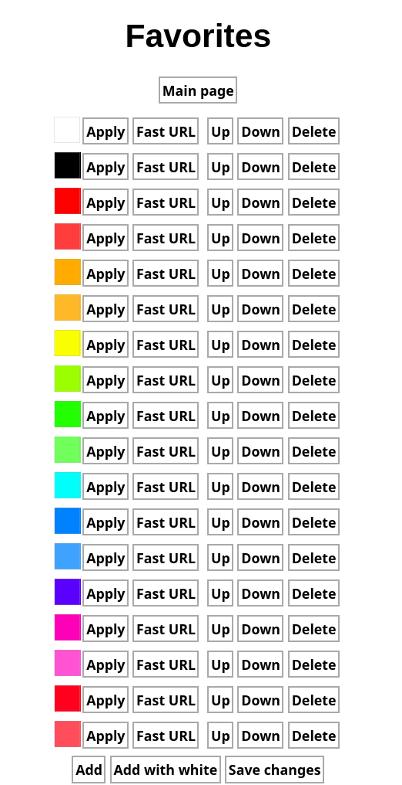

# IOT RGB Led driver

Project was designed for XIAO ESP32C3.


## Example hardware application


## Screenshots

### Mobile


### Landscape (for computers)


### No-script (for bricks)


### Favorites




### Confguration


### Everything available also in dark-mode (auto detect)


## Applications

When multiplexer:
 * multiplexer select to D4, D5, D6; COM OUT/IN to A0

 * when A1 is disconnected:
   - max 4 thermistors: reading from A0 and connect them to multiplexer to channels 0, 1, 2, 3
   - max 4 potentiomters: reading from A0 and connect them to multiplexer to channels 4, 5, 6, 7

 * when A1 is grounded:
   - no thermistors
   - max 4 potentiomters: reading from A0 and connect them to multiplexer to channels 0, 1, 2, 3

 * when A1 is connected to high:
   - max 4 thermistors: reading from A0 and connect them to multiplexer to channels 0, 1, 2, 3
   - no potentiomters

 * fan connected to D2 (A2)


When no multiplexer:
 * connect together pins D4, D5, D6
 * max 3 potentiomters connected to A0, A1, A2
 * fan connected to D4

## How to use docker container
```
docker build -t led_driver . && docker run -it -p 8000:8000 led_driver
```
then open http://0.0.0.0:8000 in your browser and download a binary file.

You can aslo run a script which builds the image, runs the container, downloads this file automatically and removes the container:
```
./compile_with_docker.sh
```

The file `main.ino.bin` can be uploaded on `Configuration` page in `Update` tab.


## How to connect first time

* Scan networks and find network with SSID `LedDriver` and connect to them with `ledDriver` password. Then type in browser `http://192.168.1.1`.
* If you do not see any network with SSID `LedDriver`, create it on your phone with password `ledDriver` and restart the driver.

Unfortunately, there is no way to predetermine driver's IP address in network other than its own AccessPoint. <br>
And **NEVER** use *https* protocol.