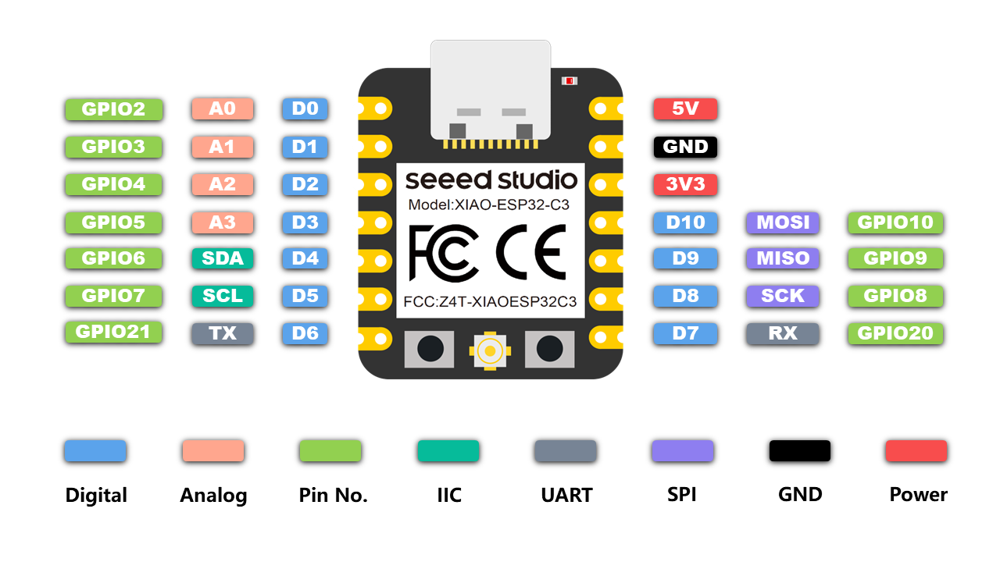
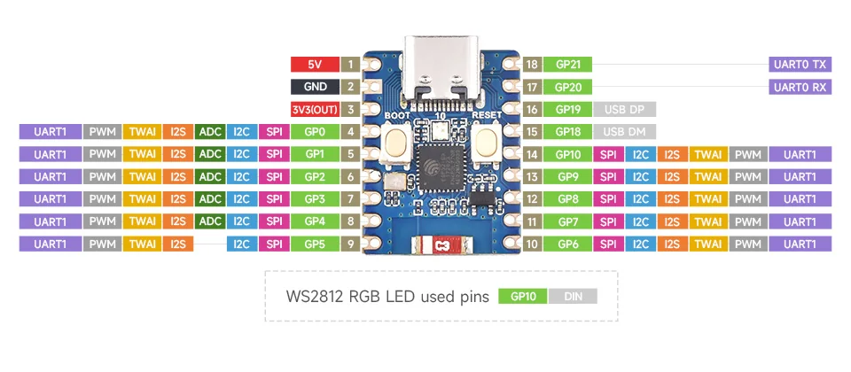

# IOT RGB Led driver

Project was designed for XIAO ESP32C3 and Waveshare ESP32C3-Zero.

## Example hardware application


## Screenshots

### Mobile


### Landscape (for computers)


### No-script (for bricks)


### Favorites


### Confguration


### Everything available also in dark-mode (auto detect)


## Applications

### How it works

Select one of four possible configurations:
* Multiplexer #1
* Multiplexer #2
* Multiplexer #3
* No multiplexer

Each configuration might be modified by disconnecting potentiometers or removing thermistors.
The software matches pins automatically.

### Table with led driver pinout

Pin|Name|XIAO|Waveshare|Multiplexer #1|Multiplexer #2|Multiplexer #3|No multiplexer|Comment
---|----|----|---------|--------------|--------------|--------------|--------------|-------
1|LNA_IN|ANT|ANT|ANT|ANT|ANT|ANT|
2|VDD3P3|VCC 3,3|VCC 3,3|VCC 3,3|VCC 3,3|VCC 3,3|VCC 3,3|
3|VDD3P3|VCC 3,3|VCC 3,3|||||
4|XTAL_32K_P|internal|GP0|||||Cannot be connected during the booting (H/Z)
5|XTAL_32K_N|internal|GP1|||||Cannot be connected during the booting (H/Z)
6|GPIO2|D0|GP2|Mult COM|Mult COM|Mult COM|Potentiometer 0|
7||EN|EN|||||
8|GPIO3|D1|GP3|H/Z|GND|UP|Potentiometer 1|
9|MTMS|D2|GP4|FAN|FAN|FAN|Potentiometer 2|
10|MTDI|D3|GP5|FLASH RST|FLASH RST|FLASH RST|FLASH RST|
11|VDD3P3_RTC|VCC 3,3|VCC 3,3|||||
12|MTCK|D4|GP6|Mult. SEL0|Mult. SEL0|Mult. SEL0|FAN (short them all)|
13|MTDO|D5|GP7|Mult. SEL1|Mult. SEL1|Mult. SEL1|FAN (short them all)|
14|GPIO8|D8|GP8|LED OUT 1|LED OUT 1|LED OUT 1|LED OUT 1|
15|GPIO9|D9|GP9|LED OUT 2|LED OUT 2|LED OUT 2|LED OUT 2|Must be pulled-up during the booting
16|GPIO10|D10|GP10|LED OUT 3|LED OUT 3|LED OUT 3|LED OUT 3|
17|VDD3P3_CPU|VCC 3,3|VCC 3,3|||||
18|VDD_SPI|VDD SPI|VDD SPI|||||
19|SPIHD|internal|internal|||||
20|SPIWP|internal|internal|||||
21|SPICS0|internal|internal|||||
22|SPICLK|internal|internal|||||
23|SPID|internal|internal|||||
24|SPIQ|internal|internal|||||
25|GPIO18|internal|ESP_USB_DP|||||
26|GPIO19|internal|ESP_USB_DM|||||
27|U0RXD|D7|GP20|LED OUT 0|LED OUT 0|LED OUT 0|LED OUT 0|
28|U0TXD|D6|GP21|Mult. SEL2|Mult. SEL2|Mult. SEL2|FAN (short them all)|
29|XTAL_N|internal|internal|||||
30|XTAL_P|internal|internal|||||
31|VDDA|internal|internal|||||
32|VDDA|internal|internal|||||
33|GND|GND|GND|||||
Mult. Ch0||||Thermistor 0|Potentiometer 0|Thermistor 0||
Mult. Ch1||||Thermistor 1|Potentiometer 1|Thermistor 1||
Mult. Ch2||||Thermistor 2|Potentiometer 2|Thermistor 2||
Mult. Ch3||||Thermistor 3|Potentiometer 3|Thermistor 3||
Mult. Ch4||||Potentiometer 0||||
Mult. Ch5||||Potentiometer 1||||
Mult. Ch6||||Potentiometer 2||||
Mult. Ch7||||Potentiometer 3||||


### XIAO ESP32C3 board pinout - cheat sheet



### Waveshare ESP32C3-Zero board pinout - cheat sheet



## How to use docker container
```
docker build -t led_driver . && docker run -it -p 8000:8000 led_driver
```
then open http://0.0.0.0:8000 in your browser and download a binary file.

You can aslo run a script which builds the image, runs the container, downloads this file automatically and removes the container:
```
./compile_with_docker.sh
```

The file `main.ino.bin` can be uploaded on `Configuration` page in `Update` tab.


## How to connect first time

* Scan networks and find network with SSID `LedDriver` and connect to them with `ledDriver` password. Then type in browser `http://192.168.1.1`.
* If you do not see any network with SSID `LedDriver`, create it (as a Hotspot) on your phone with password `ledDriver` and restart the driver.

Unfortunately, there is no way to predetermine driver's IP address in a network other than its own AccessPoint. <br>
The driver supports mDNS technology. After connecting to your network, try to enter the driver's hostname with suffix `.local` (f.e.: `http://led-driver.local`) in an address bar of a browser. Sometimes this technology requires a while to be detected by other devices in the network.<br>
In case of using `https` protocol you may be warned about danger of self signed or untrusted certificate.
Skip it and/or add this certificate to exceptions. 
