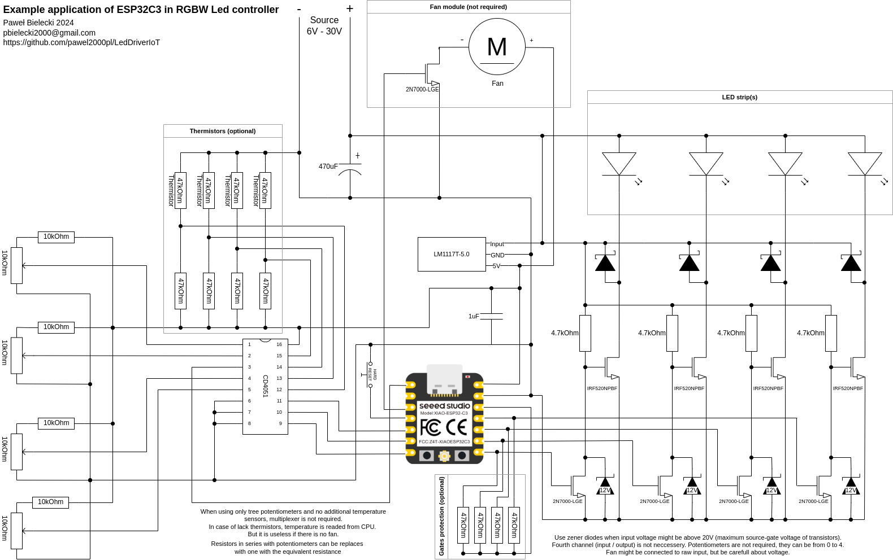

# IOT RGB Led driver

Project was designed for XIAO ESP32C3.

## Example hardware application

## Screenshots

### Mobile

### Landscape (for computers)

### No-script (for bricks)

### Confguration

### Everything available also in dark-mode (auto detect)

## Applications

When multiplexer:
 * multiplexer select to D6, D5, D4; COM OUT/IN to A0

 * when A1 is disconnected:
   - max 4 thermistors: reading from A0 and connect them to multiplexer to channels 0, 1, 2, 3
   - max 4 potentiomters: reading from and connect them to multiplexer to channels 4, 5, 6, 7

 * when A1 is grounded:
   - no thermistors
   - max 4 potentiomters: reading from and connect them to multiplexer to channels 0, 1, 2, 3

 * when A1 is connected to high:
   - max 4 thermistors: reading from and connect them to multiplexer to channels 0, 1, 2, 3
   - no potentiomters

 * fan connected to D2 (A2)

When no multiplexer:
 * connect together pins D6, D5, D4
 * max 3 potentiomters connected to A0, A1, A2
 * fan connected to D4